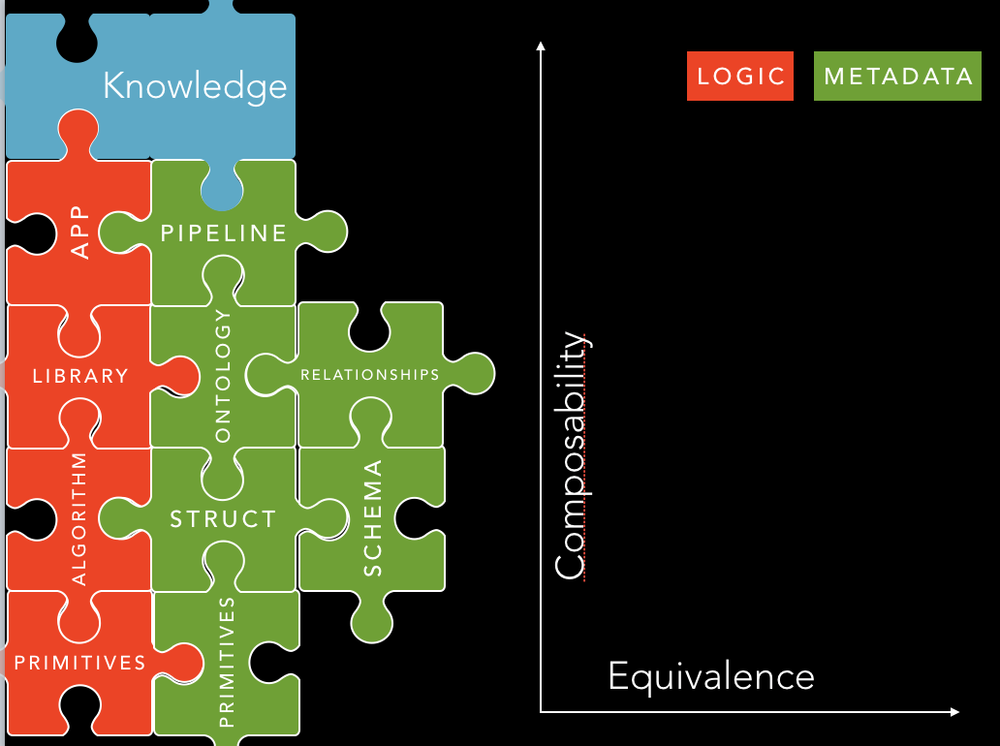

# Dogg3rz is the Git for Metadata

Welcome to the Dogg3rz project! Dogg3rz is data's best friend :)

## Overview

Dogg3rz is a decentralized version control management tool for Metadata. Dogg3rz
seeks to address the disparity that exists between the development of logic and
data in our digital knowledge infrastructure.

Through Open Source, with Git as it's catalyzing agent, the software development
community has at their disposal unfettered access to a plethora of software
libraries, components, and frameworks  with no barriers to discover, use, and
share source code for their projects.

However, no equivalent  exists for the worldwide data community to share in the development
of a global metadata commons. Dogg3rz seeks to address the visibility,
accessibility, and usability issues of metadata and the data it describes.

The realization of this would result in a community curated environment for
metadata that spans utility across organizations, industries, and domains.

## Approach

The Dogg3rz project views logic and data as intrinsically intertwined elements
that compose our digital knowledge infrastructure. They share fundamentally
common characteristics in composability through their respective building blocks.  
As such, the Dogg3rz Project seeks to leverage these common characteristics to
provide an equivalent development environment to develop metadata projects where
data developers can curate, version, relate, share,  and combine metadata  
with other Dogg3rz projects to collectively stitch together a global metadata commons.  

## Contributing

The Dogg3rz Project is a work in progress. As such, there's a few things you can do right now to help out:

-   **Ask questions**! We'll try to help. Be sure to drop a note (on the above issue) if there is anything you'd like to work on and we'll update the issue to let others know. Also [get in touch](https://slack.textile.io) on Slack.
-   **Open issues**, [file issues](https://github.com/datacequia/go-dogg3rz/issues), submit pull requests!
-   **Perform code reviews**. More eyes will help a) speed the project along b) ensure quality and c) reduce possible future bugs.
-   **Take a look at the code**. Contributions here that would be most helpful are **top-level comments** about how it should look based on your understanding. Again, the more eyes the better.
-   **Add tests**. There can never be enough tests.

# License

[Affero GPL 3.0](LICENSE)
